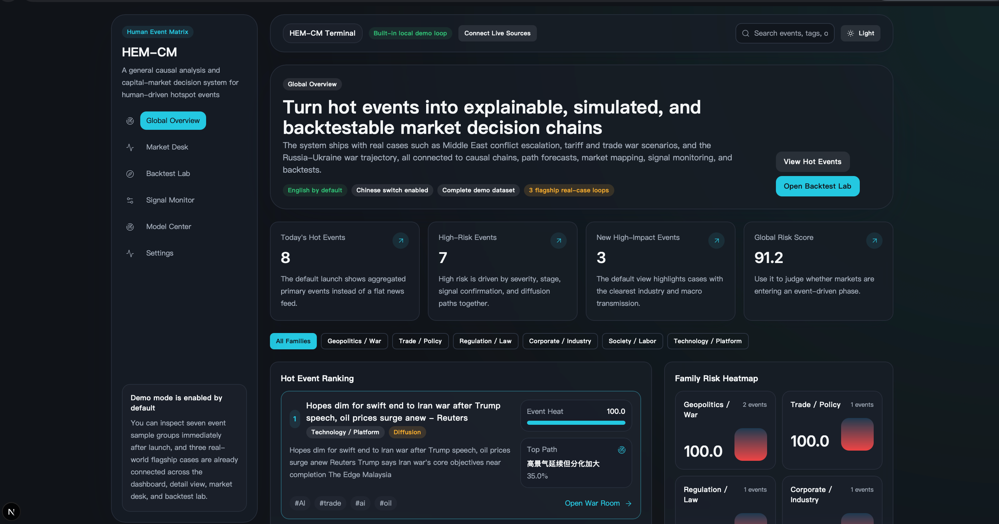
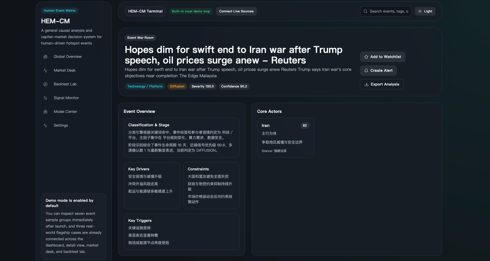
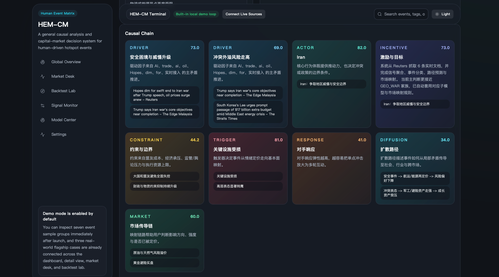
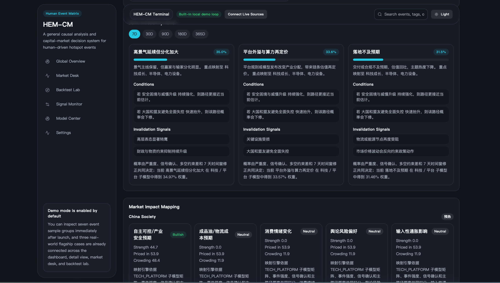
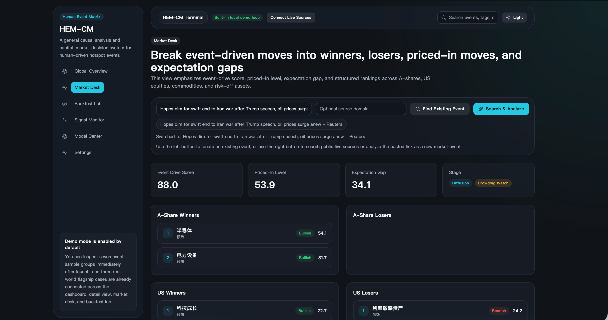
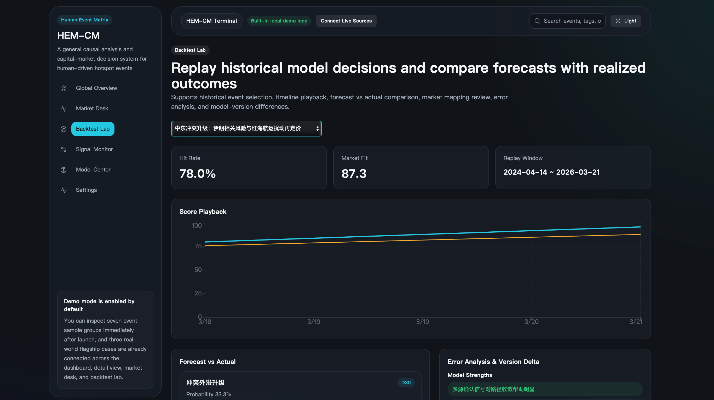

# HEM-CM

[](./LICENSE)
[](https://github.com/beckzou123-lang/hem-cm/actions/workflows/ci.yml)
[](https://github.com/beckzou123-lang/hem-cm/issues)

Open-source event intelligence terminal for capital markets.

Turn breaking news into explainable causal chains, scenario paths, cross-market impact maps, and replayable research workflows.



Three flagship real-case loops are already wired into the product: Middle East conflict escalation, tariff / trade-war escalation, and the Russia-Ukraine war trajectory.

## 3-Minute First Win

If you want to understand the product value in under three minutes, use this path:

1. Run `./scripts/dev.sh`
2. Open the Global Overview and inspect the top-ranked real-case event
3. Enter the Event War Room to see the causal chain, stage, and path forecast
4. Open Market Desk to inspect winners, losers, priced-in level, and expectation gap
5. Open Backtest Lab to compare the forecast with realized outcomes

This is the shortest path from repo landing page to "I see why this product is different."

## Why People Star HEM-CM

- It is a working product, not a dashboard shell or static concept repo.
- It connects source intake, causal reasoning, scenario forecasting, market translation, and backtest replay in one loop.
- It ships with real event cases and high-density screenshots that make the product value obvious in under a minute.
- It is local-first, inspectable, and easy to extend for AI-assisted research workflows.

**Try it now**

- One-command demo: `./scripts/dev.sh`
- Quick start: `npm install` → `npm run dev`
- Jump to screenshots: [Global Overview](#global-overview) · [Event War Room](#event-war-room) · [Market Desk](#market-desk) · [Backtest Lab](#backtest-lab)

## Why It Feels Different

| Typical market-news dashboard | HEM-CM |
| --- | --- |
| Flattens headlines into a feed | Aggregates signals into explainable primary events |
| Gives one-line summaries | Builds causal chains, stage labels, and actor logic |
| Stops at "bullish / bearish" | Produces multi-horizon paths with conditions and invalidation signals |
| Rarely closes the loop | Includes replay, fit score, and error analysis |
| Looks like a concept demo | Ships as a local-first product with seeded real cases |

## What You Get

- Explainable event reasoning with stages, conditions, and invalidation signals
- Multi-horizon scenario paths across 7 / 30 / 90 / 180 / 365-day windows
- Cross-market translation into A-shares, US equities, commodities, and macro risk buckets
- Local-first workflow from source intake to model output, analysis, replay, and validation

## Built For

- Investors and researchers who want more than a flat headline feed
- Macro, policy, and cross-asset thinkers who need scenario paths instead of one-line takes
- Builders who want an auditable event-intelligence codebase instead of a black-box demo

## Why HEM-CM

Most market dashboards stop at aggregation. HEM-CM goes further:

- It classifies events into explainable geopolitical, regulatory, trade, corporate, social, and technology families.
- It identifies the current event stage instead of treating all signals as equal.
- It generates multi-horizon path forecasts with conditions and invalidation signals.
- It maps the same event into A-shares, US equities, commodities, and macro risk buckets.
- It ships as a full local product, not just a static mockup.

## Core Highlights

- **General causal parent model + six event sub-models**  
  The system uses one reusable causal backbone and six configurable event families, making the logic transparent and extensible.

- **Explainable path forecasting**  
  Each event produces 7 / 30 / 90 / 180 / 365-day horizons, with three scenario paths per horizon.

- **Cross-market impact engine**  
  One event can be translated into sector winners, losers, priced-in levels, crowding, and macro risk appetite shifts.

- **Live source intake workflow**  
  Users can ingest Google News search results, site-specific results, RSS feeds, JSON endpoints, or webpages directly into the event pipeline.

- **Backtest and replay lab**  
  The product does not stop at prediction. It includes replay windows, realized outcomes, fit scores, and error analysis.

- **Bilingual product experience**  
  The interface supports English and Chinese, with English as the default language.

## Product Surface

- `/` Global Overview: hot events, family risk heatmap, cross-market overview, signal stream
- `/events/[id]` Event War Room: causal chain, actors, scenario paths, impact grid, export, alert, watchlist
- `/markets` Market Desk: sector ranking, priced-in status, expectation gap, event search and live analysis
- `/backtests` Backtest Lab: replay windows, forecast vs actual outcome, fit score, error analysis
- `/signals` Signal Monitor: multi-source confirmation, signal grading, model-entry status, live source ingestion
- `/models` Model Center: parent model, sub-models, thresholds, variables, versions, source rules
- `/settings` Settings: language, theme, refresh cadence, demo mode, export format, market preference

## Screenshots

### Global Overview

Hot events, family risk heatmap, and the cross-market signal surface in one command center.


### Event War Room

Inspect causal chains, scenario paths, actor responses, and event-specific market transmission.



Inspect the structured causal cards that turn one event into drivers, constraints, triggers, opponent responses, diffusion, and market transmission.



See multi-horizon path forecasts and market impact mapping in the same research flow, without leaving the war room.



### Market Desk

Translate one event into ranked winners, losers, priced-in moves, and risk-off transmission.



### Backtest Lab

Replay model decisions against realized outcomes and inspect fit scores, error sources, and version deltas.



## Flagship Event Loops

- Middle East conflict escalation: causal chain, path forecast, oil / shipping / risk-off transmission
- Tariff and trade-war escalation: policy conflict logic, inflation pressure, sector rotation, market mapping
- Russia-Ukraine war trajectory: multi-horizon path comparison, energy transmission, replay and fit review

These are not isolated screenshots. They are already wired into the seeded dataset, model flow, market mapping, and backtest experience.

## Community Entry Points

If you want to help this repo become the best open-source event-intelligence product in public:

- Open a source-adapter request if there is a public feed you want connected
- Open an event-case request if there is a geopolitical, policy, or corporate event family worth modeling
- Open a model-feedback issue if a path forecast, market mapping, or replay explanation feels wrong
- Pick up a scoped starter task from the issue tracker if you want to contribute directly

## Documentation

- Product docs: [中文说明](./README.zh-CN.md) · [Highlights](./docs/PROJECT_HIGHLIGHTS.md) · [Architecture](./docs/ARCHITECTURE.md) · [Adapter Guide](./docs/ADAPTER_GUIDE.md) · [Model Guide](./docs/MODEL_GUIDE.md)
- Open-source ops: [Repo Checklist](./docs/REPO_CHECKLIST.md) · [Maintainer Playbook](./docs/MAINTAINER_PLAYBOOK.md) · [Security](./SECURITY.md) · [Roadmap](./ROADMAP.md)
- Launch materials: [Release Notes](./docs/RELEASE_v1.0.1.md) · [Launch Kit](./docs/LAUNCH_KIT.md) · [Community Posts](./docs/COMMUNITY_POSTS.md) · [GitHub About Kit](./docs/GITHUB_ABOUT.md)

## Model Design

### 1. Parent causal model

The parent model is designed around reusable event reasoning primitives:

- actors
- objectives
- incentives
- constraints
- triggers
- responses
- diffusion paths
- market transmission layers

This makes HEM-CM feel like an event operating system rather than a simple news board.

### 2. Six specialized event sub-models

The current repository includes dedicated configurations for:

- geopolitics / war
- trade / policy
- regulation / law
- corporate / industry
- society / labor
- technology / platform

Each sub-model contains:

- its own variables
- weights
- stage biases
- path templates
- market mapping matrices
- UI focus areas

### 3. Scenario forecasting

Forecasting is deliberately explainable:

- fixed horizon set
- three path candidates per horizon
- probability normalization
- stage-aware scoring
- explicit conditions and invalidation signals

### 4. Market mapping

The market engine converts event understanding into structured downstream views:

- China society
- A-shares
- US equities
- commodities
- rates / FX / risk appetite

## AI and Tooling Perspective

HEM-CM is intentionally not a black-box LLM demo.

- The current engine is rule-based, configuration-driven, and locally reproducible.
- The architecture is easy to audit, validate, and extend.
- It is a strong foundation for future AI augmentation, such as:
  - retrieval-assisted evidence ranking
  - LLM-assisted signal summarization
  - model critique and scenario explanation
  - multilingual content generation

This design makes the repository useful both as a working product and as an AI-ready research platform.

## Tech Stack

- Next.js 15
- React 19
- TypeScript
- Prisma
- SQLite
- Tailwind CSS
- Recharts
- Zod
- Zustand

## Quick Start

### 1. Install dependencies

```bash
npm install
```

### 2. Prepare environment variables

```bash
cp .env.example .env
```

### 3. Initialize SQLite

```bash
npm run db:init
```

If you want to regenerate the initialization SQL yourself:

```bash
npx prisma migrate diff --from-empty --to-schema-datamodel prisma/schema.prisma --script > prisma/init.sql
npm run db:init
```

### 4. Seed demo data

```bash
npm run seed
```

### 5. Start the app

```bash
npm run dev
```

Open:

```text
http://localhost:3000
```

## One-Command Demo

```bash
./scripts/dev.sh
```

## Validation

Run the built-in validation script:

```bash
npm run validate
```

It checks:

- flagship real-world cases exist
- each flagship case has 5 horizons × 3 paths
- market mappings are generated
- causal chains are generated
- probabilities are close to normalized

## Repository Structure

```text
HEM.CM_System/
├── app/
├── components/
├── modules/
├── lib/
├── prisma/
├── data/
├── scripts/
├── public/
├── tests/
├── .env.example
├── package.json
└── README.md
```

## Open Source Roadmap

- richer multilingual content generation
- more event families and source adapters
- stronger replay evaluation metrics
- collaboration and annotation workflows
- optional AI copilot modules for evidence explanation

## GitHub Launch Notes

- Repository pitch: open-source event intelligence terminal for causal analysis, scenario forecasting, and market mapping
- Best GitHub topics: `event-intelligence`, `capital-markets`, `causal-engine`, `scenario-analysis`, `market-mapping`, `nextjs`, `typescript`, `prisma`, `sqlite`, `open-source`
- Maintainer helper: see [docs/GITHUB_ABOUT.md](./docs/GITHUB_ABOUT.md) for About text, topics, and showcase copy

## Notes

- Demo data ships with the repository so the product is visible immediately after setup.
- Live-source extraction depends on target site accessibility and structure stability.
- Model thresholds and source rules can be tuned from the Model Center.
- The default interface language is English, and Chinese can be switched on from Settings.

## Contributing

Contributions are welcome. Please read [CONTRIBUTING.md](./CONTRIBUTING.md) before opening a pull request.

## License

MIT. See [LICENSE](./LICENSE).
