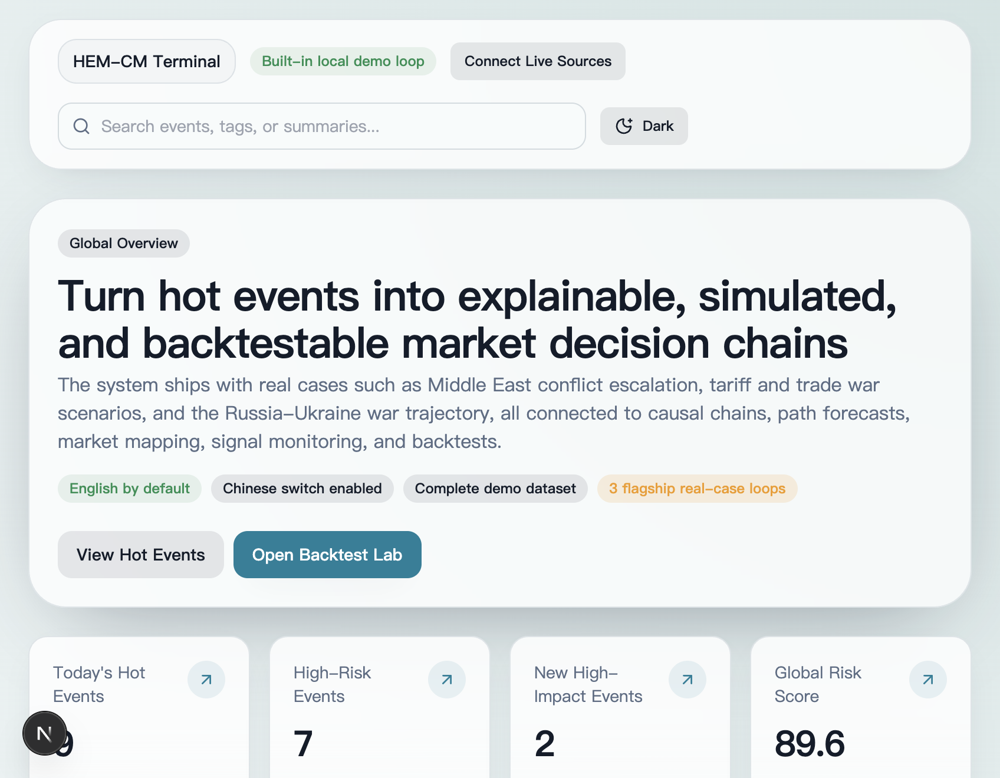
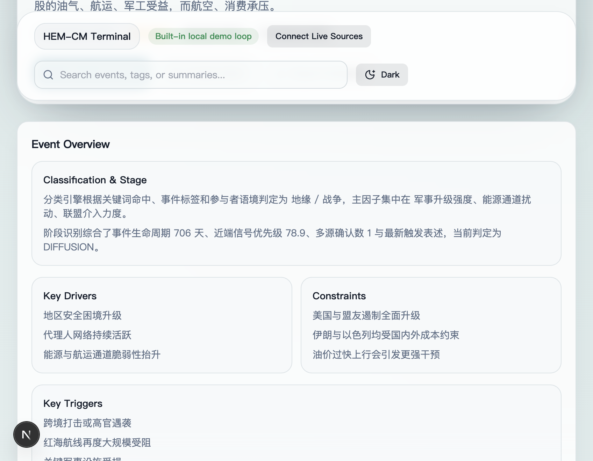
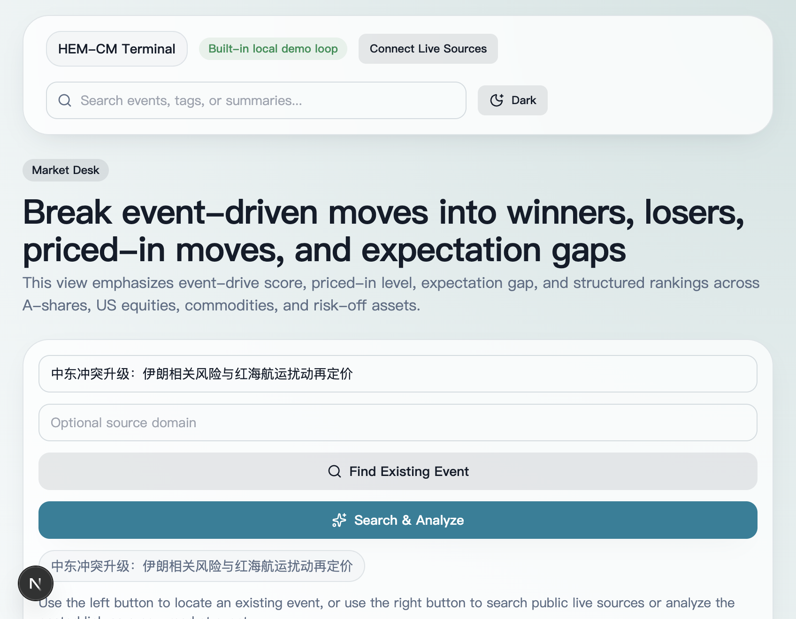
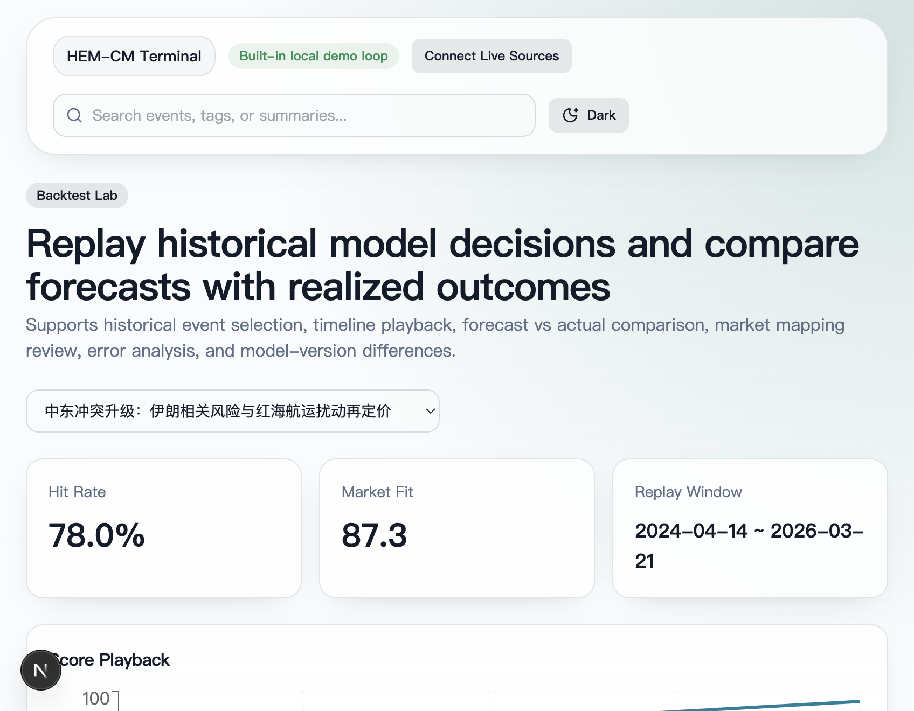

# HEM-CM

面向资本市场的开源事件智能研究终端。

把突发新闻与热点事件转成可解释的因果链、多情景路径推演、跨市场影响映射和可回放的研究工作流。

## 立即上手

- 一键演示：`./scripts/dev.sh`
- 快速启动：`npm install` → `npm run dev`
- 直达截图： [全局态势台](#全局态势台) · [事件作战室](#事件作战室) · [资本市场作战台](#资本市场作战台) · [回测实验室](#回测实验室)
- 项目资料： [English README](./README.md) · [项目亮点](./docs/PROJECT_HIGHLIGHTS.zh-CN.md) · [路线图](./ROADMAP.md) · [首发 Release 文案](./docs/RELEASE_v1.0.0.md) · [宣传文案包](./docs/LAUNCH_KIT.md) · [社区投递文案](./docs/COMMUNITY_POSTS.md) · [GitHub 文案包](./docs/GITHUB_ABOUT.zh-CN.md)

## 你能获得什么

- 可解释的事件理解：阶段、成立条件、失效信号一体化呈现
- 多时间窗路径推演：覆盖 7 / 30 / 90 / 180 / 365 天
- 跨市场映射：联动 A 股、美股、商品与宏观风险偏好
- 本地优先工作流：从信源接入到分析、回放、验证全部可落地

## 项目定位

大多数资讯或行情工具只做到“聚合”，HEM-CM 重点解决的是“理解、推演、映射、验证”：

- 把事件归类到可解释的事件家族
- 判断事件处于哪个阶段，而不是把所有信号一视同仁
- 生成多时间窗路径预测，并给出成立条件与失效信号
- 把同一事件映射到 A 股、美股、商品和宏观风险偏好
- 以本地可运行产品的形式交付，而不是静态原型

## 核心亮点

- **通用因果母模型 + 六类子模型**  
  一套通用事件理解框架，叠加六类可配置事件子模型，便于解释、扩展和演进。

- **可解释路径预测**  
  固定输出 7 / 30 / 90 / 180 / 365 天五个时间窗，并为每个时间窗生成三条候选路径。

- **跨市场映射能力**  
  同一事件会被映射成受益链、受损链、已定价程度、拥挤度和宏观风险变化。

- **真实源接入闭环**  
  支持 Google News 检索、指定站点检索、RSS、JSON、网页链接接入，并自动进入正式事件链路。

- **回测实验室**  
  不只给预测，还能看 replay、真实落地、误差分析与模型拟合。

- **中英双语界面**  
  默认英语展示，也支持切换到中文界面。

## 模型设计思路

### 1. 通用因果母模型

母模型围绕一组可复用事件理解原语构建：

- 行为体
- 目标
- 激励
- 约束
- 触发因素
- 响应
- 扩散路径
- 市场传导层

这使得 HEM-CM 更像一个“事件理解操作系统”，而不是简单的新闻列表。

### 2. 六类事件子模型

当前仓库已经内置六类子模型：

- 地缘 / 战争
- 贸易 / 政策
- 监管 / 法律
- 企业 / 产业
- 社会 / 劳工
- 科技 / 平台

每类子模型都自带：

- 专属变量
- 权重
- 阶段偏置
- 路径模板
- 市场映射矩阵
- 展示重点

### 3. 路径预测引擎

路径预测不是黑盒输出，而是显式结构化结果：

- 固定时间窗集合
- 每窗三条路径
- 概率归一
- 阶段感知
- 成立条件
- 失效信号

### 4. 市场映射引擎

市场映射把事件理解结果进一步转成结构化市场视图：

- 国内社会
- A 股
- 美股
- 商品
- 利率 / 汇率 / 风险偏好

## AI 与工具视角

HEM-CM 当前并不是依赖外部大模型的黑盒演示。

- 现在的核心引擎是规则化、配置化、可本地复现的
- 模型逻辑可以审计、验证、调试
- 仓库已经具备继续接入 AI 能力的理想基础，例如：
  - 证据检索与排序
  - LLM 辅助信号摘要
  - 路径解释自动生成
  - 多语言内容生成

换句话说，它既是可运行的产品，也是一套很适合继续叠加 AI 能力的研究平台。

## 产品页面

- `/` 全局态势台：首页、热点榜单、风险热力图、信号流
- `/events/[id]` 事件作战室：因果链、参与者、路径概率、市场影响、导出/预警/关注
- `/markets` 资本市场作战台：受益/受损排序、预期差、实时分析接入
- `/backtests` 回测实验室：历史回放、预测 vs 实际、误差分析
- `/signals` 高频信号中心：多源确认、信号分级、实时源接入
- `/models` 模型管理：母模型、子模型、阈值、变量、版本、信源规则
- `/settings` 设置页：语言、主题、刷新频率、演示模式、导出格式

## 截图预览

### 全局态势台

在一个总控视图中查看热点事件、事件家族热力图与跨市场信号面。



### 事件作战室

查看因果链、路径推演、参与者响应和事件级市场传导。



### 资本市场作战台

把同一事件快速拆解成受益、受损、已定价程度与风险偏好传导。



### 回测实验室

把模型预测与真实结果放在同一视图内，对比拟合分、误差来源与版本差异。



## 技术栈

- Next.js 15
- React 19
- TypeScript
- Prisma
- SQLite
- Tailwind CSS
- Recharts
- Zod
- Zustand

## 快速启动

### 1. 安装依赖

```bash
npm install
```

### 2. 准备环境变量

```bash
cp .env.example .env
```

### 3. 初始化数据库

```bash
npm run db:init
```

如需自行重新生成初始化 SQL：

```bash
npx prisma migrate diff --from-empty --to-schema-datamodel prisma/schema.prisma --script > prisma/init.sql
npm run db:init
```

### 4. 导入种子数据

```bash
npm run seed
```

### 5. 启动系统

```bash
npm run dev
```

浏览器访问：

```text
http://localhost:3000
```

## 一键演示

```bash
./scripts/dev.sh
```

## 验证

```bash
npm run validate
```

验证脚本会检查：

- 重点案例是否存在
- 每个重点案例是否具备 5 个时间窗 × 3 条路径
- 市场映射是否已生成
- 因果链是否已生成
- 概率是否接近归一

## 开源规划

- 更强的多语言内容层
- 更多事件家族与外部数据源
- 更细粒度的回测评价指标
- 协作标注与研究工作流
- AI 辅助解释模块

## GitHub 展示备注

- 仓库一句话定位：面向资本市场的开源事件智能终端，强调因果分析、路径预测与市场映射
- 推荐 Topics：`event-intelligence`、`capital-markets`、`causal-engine`、`scenario-analysis`、`market-mapping`、`nextjs`、`typescript`、`prisma`、`sqlite`、`open-source`
- 维护者文案参考：见 [docs/GITHUB_ABOUT.md](./docs/GITHUB_ABOUT.md)

## 备注

- 仓库内置 demo 数据，首次启动即可看到完整产品效果
- 实时源抓取效果取决于目标站点的可访问性和结构稳定性
- 模型阈值和信源规则可在模型管理页中直接调整
- 默认语言为英文，可在设置页中切换为中文

## 贡献

欢迎贡献。提交 PR 前请阅读 [CONTRIBUTING.md](./CONTRIBUTING.md)。

## 许可证

MIT，详见 [LICENSE](./LICENSE)。
